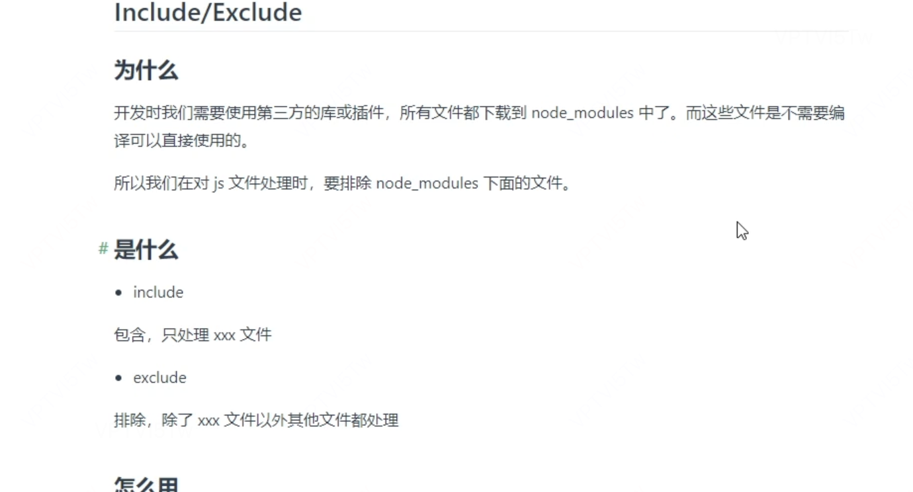
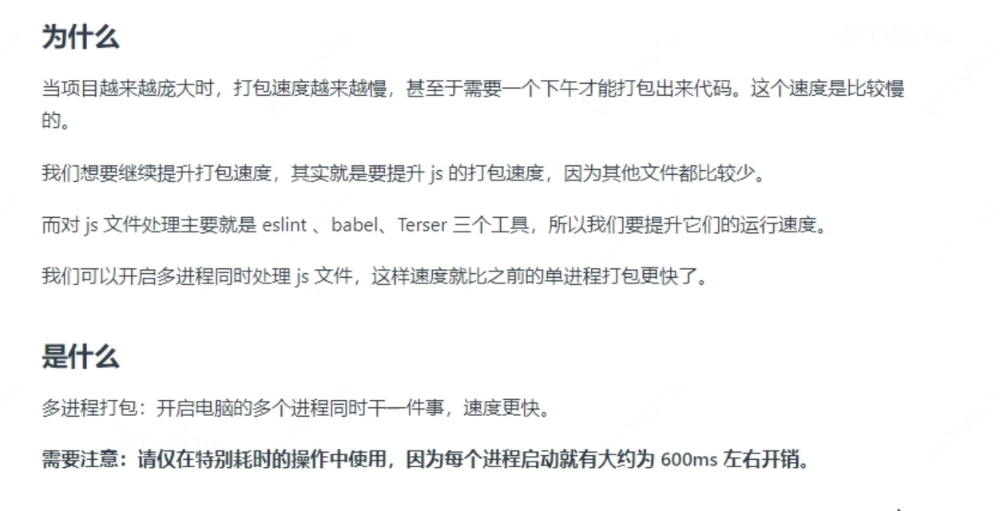

# webpack优化部分

### 1. 提升开发体验
[sourcemap](https://yk2012.github.io/sgg_webpack5/senior/enhanceExperience.html#sourcemap)
sourcemap是一个用于映射源文件和编译后文件的映射map方案，会讲源码和编译后的代码进行一一对应，映射查找是浏览器去做的

devtool配置用来控制以及如何生成sourcemap，选择不同的sourcemap方式会影响构建以及再次构建的速度
根据习惯：
    - 开发模式用cheap-module-source-map
      - 打包构建很快，只关注行对应关系
    - 生产模式用source-map
      - 打包构建很慢，但是会关注全量的行列对应关系


### 2. 提升打包构建速度
#### HMR 
热更新，提升二次构建效率，当代码更新的时候只打包更新的代码
暂时在本项目中不去考虑HMR原理，只去看怎么用就行，先在devServer中将hot设置为true，style-loader天然支持hmr
否则使用module.hot判断，但是在一些loader比如vue-loader会去做这件事

#### oneOf
匹配loader，只要满足一个就不再使用后面的loader了
```js

{
    rules: [
        oneOf: [
            {
                loader: 'xxxx'
            },
            {
                loader: 'xxx'
            }
        ]
    ]
}
```

#### include / exclude


#### js cache
缓存eslint和babel,针对于生产模式
babel需要额外开启options的cache并且关闭cacheCompression
eslint需要开启cache并且指定cacheLocation


#### 多线程构建

需要配置eslint、loader和terser


### 3. 减少代码体积

#### tree shaking
tree shaking需要依赖于ES Module（即使用import和export）静态分析，而cjs是动态引入的所以它并不支持tree-shaking，并且tree-shaking需要使用解构导入，全量引入是不会致使tree-shaking生效的。
在早期版本的babel中可能会存在致使tree-shaking失效的情况，但是在7.8版本之后这种问题就已经解决了。反而大部分时候导致tree-shaking失效的主要原因是副作用，除非你愿意使用/* __PURE__ */标记来优化生产代码，不过这常常会带来更大的心理包袱和代码漏洞，因此在我们的代码中需要更加谨慎的应对副作用

[为什么Tree-shaking大部分都不好使？](https://zhuanlan.zhihu.com/p/32831172)
[ESM为什么是静态结构](https://exploringjs.com/es6/ch_modules.html#static-module-structure)
[tree-shaking和如何利用PURE【公司代码勿用】](https://juejin.cn/post/7325238090301636647?searchId=20240211100707A945C1505F083588E1C3#heading-3)


#### 减少Babel的产物体积
babel中会存在一些辅助代码，并且只要拆个chunk出来就会重新多一份。所以需要将这种东西提取出来从一个地方导入，这个插件是：@babel/plugin-transform-runtime，babel中所有的辅助代码都会从这里引入

#### 压缩图片体积插件
image-minimizer-webpack-plugin imagemin

压缩方式可以选择以下两种：
- 有损压缩：imagemin-gifsicle imagemin-mozjpeg imagemin-pngquant imagemin-svgo
- 无损压缩：imagemin-gifsicle imagemin-jpegtran imagemin-optipng imagemin-svgo

WARN：针对的是本地的静态图片


### 4. 优化代码运行性能